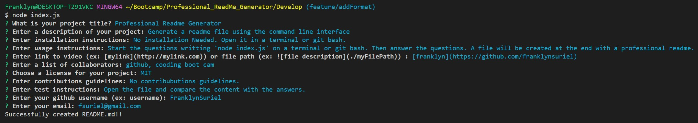

# Professional Readme Generator
 

  
## Description
  
A project to dynamically generates a proffesional README file. This will allow an user to use the command line interface to answers some questions about the their project. Once all questions are answered a file will be created. Since all projects should contain a README file this will also allow to save time on each project.   

## Table of Contents

  - [Installation](#Installation)
  - [Usage](#Usage)
  - [License](#License)
  - [Contrubutions](#Contributions)
  - [Test](#Test)
  - [Questions](#Questions)

## Installation

No installation Needed. Open it in a terminal or git bash.

## Usage

To use the professional README generator, you will have to use a terminal or git bash. To start the application use **node index.js** and answer each of the questions. After finished all question a message with the status will appear and a README.md file will be created.

## Credits

[coding-boot-camp.github.io](https://coding-boot-camp.github.io/full-stack/github/professional-readme-guide)

## License

This project is licensed under the MIT license.

## Contributing

No contribubutions guidelines.

## Test

No test avaible.

## Questions

[github.com/FranklynSuriel](https://github.com/FranklynSuriel)

Questions about this proyect or to report an issue can be sent to:
fsuriel@gmail.com. Please specify the name of the proyect in the subject of the email.

